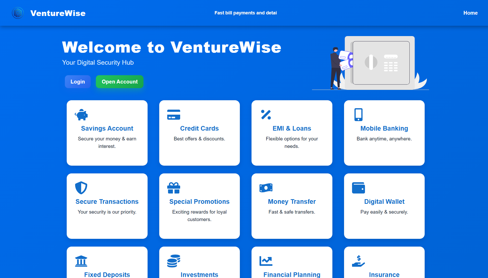
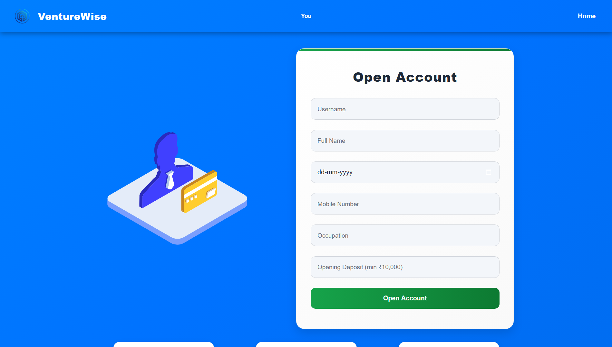
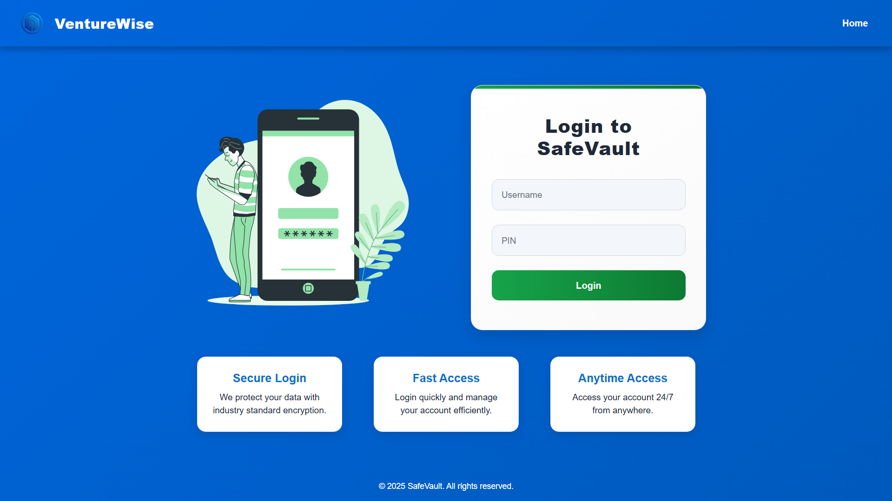
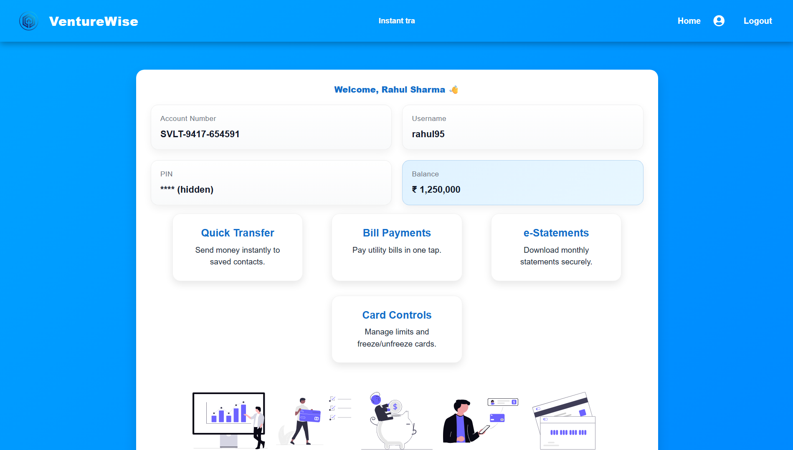

# 💼 VentureWise – Modern Banking Web App (React)

VentureWise is a sleek and modern **React-based banking app** that simulates a digital bank experience — including account creation, login, account overview, and transaction management.  
Built with React and simple utility functions, it focuses on smooth UI, responsiveness, and ease of use.

---

# Live Demo: https://venturewise.onrender.com


---

## 🖼️ Screenshots

### 🏠 Welcome Page

.png)

### 🏦 Open Account Page


### 🔐 Login Page


### 📊 Account Page


---

## 🚀 Features

- 🧭 **Intuitive Navigation** – Smooth routing with React Router.
- 🏦 **Open Account Simulation** – Users can generate a new account number and PIN.
- 🔐 **Login System** – Secure login with pre-defined credentials.
- 💰 **Account Overview** – Displays balance and transaction history.
- 🧠 **Dynamic Data** – Account generated programmatically using UUID and utility functions.
- 📱 **Responsive UI** – Fully functional on desktop and mobile.

---

🔑 Demo Login Credentials

These sample users are preloaded from data/users.js using generated account numbers and pins.

| Name          | Username | PIN       |
|----------------|-----------|-----------|
| Rahul Sharma   | rahul95   | rahul95   |
| Sneha Verma    | sneha98   | sneha98   |
| Amit Singh     | amit88    | amit88    |


---

## ⚙️ Installation & Setup

```bash
# Clone the repository
git clone https://github.com/tusshar-25/VentureWise.git

# Move into the project directory
cd VentureWise

# Install dependencies
npm install

# Start the development server
npm run dev

